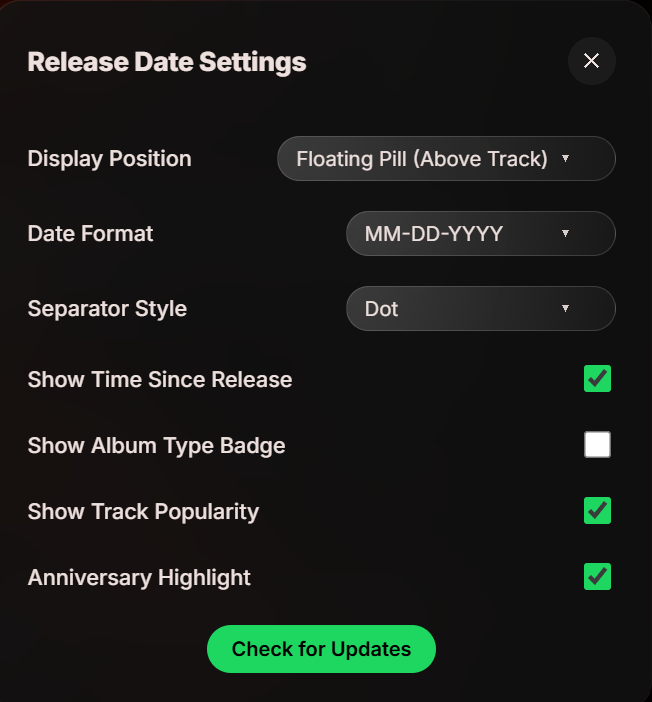

# Beautiful Release Date

A high-performance, fully modernized Spicetify extension that displays exactly when your music was released, how old it is, and how popular it currently is on Spotify. 

This is a heavily upgraded fork that fixes UI bugs, adds robust performance optimizations (caching, request coalescing), and introduces highly requested custom features!

### ✨ Features
* **Floating Pill Position:** Pin the date inside a sleek, frosted floating pill directly above the Now Playing bar, or dock it inline next to the artist/song name!
* **Track Popularity Metric:** Pulls live Spotify API data to show you how "hot" the track currently is with a flame icon (e.g., `🔥 85`).
* **Album Type Badges:** Instantly see if a track is from an `album`, `single`, or `compilation`.
* **Age Tracker:** Displays the time since release (e.g., `1y 6m`) alongside the date.
* **Anniversary Highlights:** The text pulses Spotify Green when the song is celebrating its exact birthday today! 🎉
* **OTA Updates:** A built-in "Check for Updates" button that fetches the latest patches directly from GitHub without needing to redownload files manually!

It creates a clickable element near your track info. Once clicked, it brings up a robust settings menu where you can configure everything:

### ⚙️ Configuration Options

| Option | Description |
| :--- | :--- |
| **Position** | Choose between **Floating Pill (Above Track)**, **Artist**, or **Song name**. |
| **Date Format** | Support for `DD-MM-YYYY`, `MM-DD-YYYY`, and `YYYY-MM-DD`. |
| **Separator** | Choose between a **Dot (•)**, a **Dash (-)**, or **None**. |
| **Visual Toggles** | Enable/Disable Age strings, Album Type badges, Popularity score, and Anniversary pulses. |

---

### 🛠️ Installation

1. Install directly through the **Spicetify Marketplace** by searching for **Beautiful Release Date**.
2. If it doesn't appear immediately, click **"Load More"** at the bottom of the search results!

*If you enjoy the extension, please drop a ⭐ on this repository so it ranks higher in the Marketplace!*